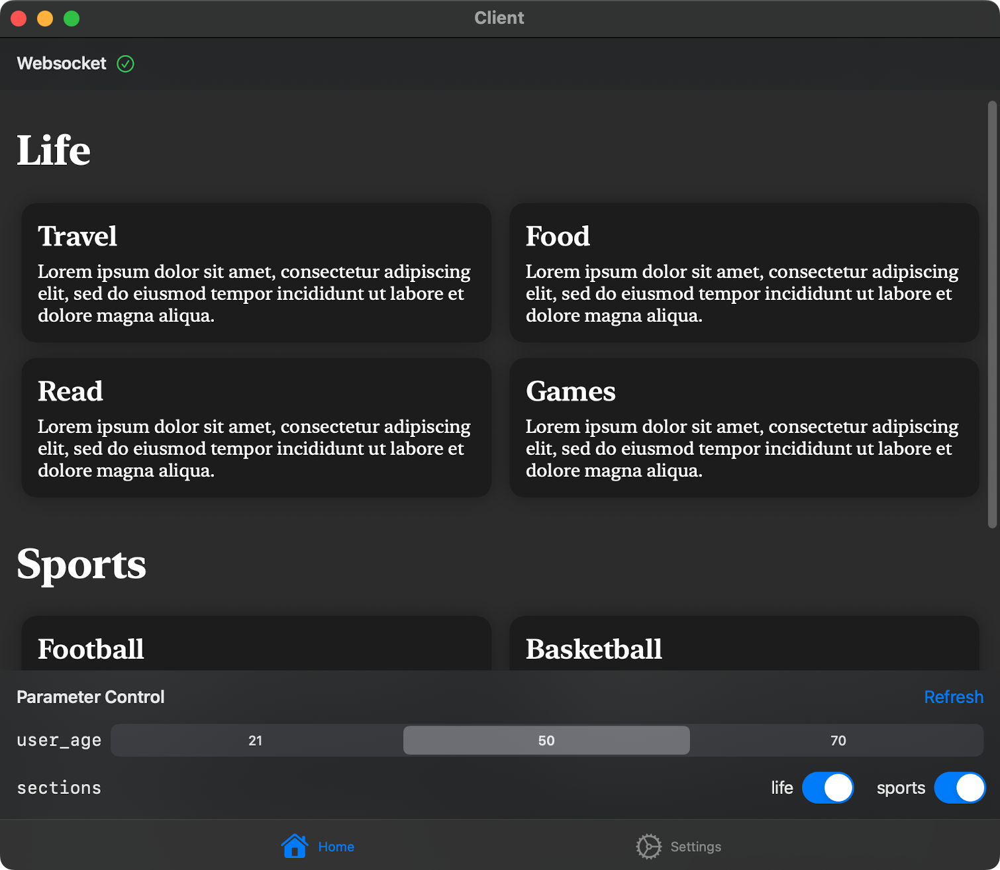

# 2022-Spring-SE-Client

2022 年春季学期软件工程课程《客户端配置系统》项目展示用 iOS 客户端，主要用来演示平台动态计算能力。本项目由字节跳动提供，详见[项目文档](https://bytedance.feishu.cn/docs/doccnfC6Mu2XVxaXL6MJNy6alFg)。

或许是一个较为完整的使用 SwiftUI 框架、MVVM 架构进行 iOS 开发的小规模例子。



## 结构

源代码包括：

1. 获取配置的 SDK（`ConfigService`），使用 Swift Package 作为库提供给 App 使用
2. 展示用 App（`Client`），使用 SwiftUI 编写

SDK 的主要功能有：

1. 为 App 提供一个统一的获取配置的接口。App 通过遵循 `ConfigRequest` 协议，可直接使用 SDK 进行网络请求，无需自己实现网络请求、错误处理、序列化和反序列化等操作。
2. 使用 WebSocket 为客户端提供配置更新的主动推送。

App 主体是一个类似于新闻主页的页面。后端配置计算脚本通过用户的年龄、用户选择的新闻类型动态地返回字体大小、排布方式以及对应的新闻数据，App 依赖返回的数据进行渲染，不作任何数据的筛选。

通过此 App，可以体现动态配置计算相对于静态配置文件的几个优点：

1. 只传输必要的数据
2. 可以针对不同情况返回不同数据
3. 方便调整配置逻辑，而无需更新客户端

## 配置计算代码

此为用于配置计算的 Python 代码。

```python
placeholder = "Lorem ipsum dolor sit amet..."

datas = {
    "life": {
        "display_name": "Life",
        "entries": [
            {"title": "Travel", "description": placeholder},
            {"title": "Food", "description": placeholder},
            {"title": "Read", "description": placeholder},
            {"title": "Games", "description": placeholder}
        ]
    },
    "sports": {
        "display_name": "Sports",
        "entries": [
            {"title": "Football", "description": placeholder},
            {"title": "Basketball", "description": placeholder},
            {"title": "Tennis", "description": placeholder}
        ]
    }
}

layouts = {
    "young": {"columns": 3, "font_scale": 1},
    "mid": {"columns": 2, "font_scale": 1.5},
    "old": {"columns": 1, "font_scale": 2}
}

user_age = p["user_age"]
key = "old" if user_age > 60 else ("mid" if user_age > 30 else "young")

sections = [{"name": k, "data": datas[k]} for k in datas if k in p["sections"]]

return {
    "sections": sections,
    "layout": layouts[key]
}
```
